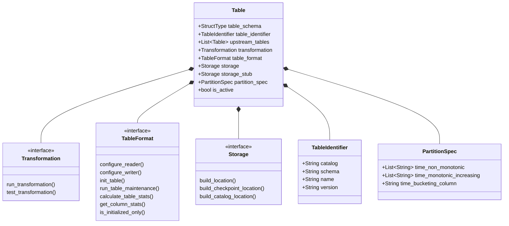

### Under development

```mermaid
classDiagram
    class Table {
        +StructType table_schema
        +TableIdentifier table_identifier
        +List~Table~ upstream_tables
        +Transformation transformation
        +TableFormat table_format
        +Storage storage
        +Storage storage_stub
        +PartitionSpec partition_spec
        +bool is_active
    }
    class TableIdentifier {
      +String catalog
      +String schema
      +String name
      +String version
    }
    class Transformation {
        <<interface>>
        run_transformation()
        test_transformation()
    }
    class TableFormat {
        <<interface>>
        configure_reader()
        configure_writer()
        init_table()
        run_table_maintenance()
        calculate_table_stats()
        get_column_stats()
        is_initialized_only()
    }
    class Storage {
        <<interface>>
        build_location()
        build_checkpoint_location()
        build_catalog_location()
    }
    class PartitionSpec {
        +List~String~ time_non_monotonic
        +List~String~ time_monotonic_increasing
        +String time_bucketing_column
    } 
    Table *-- Transformation
    Table *-- TableFormat
    Table *-- Storage
    Table *-- TableIdentifier
    Table *-- PartitionSpec
```

